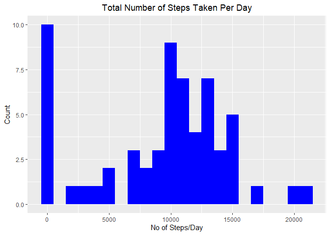
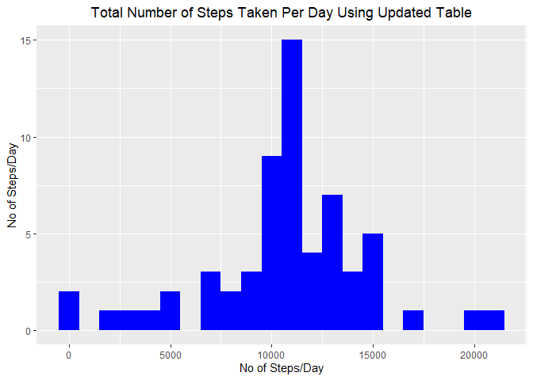

## Loading and preprocessing the data  

Loading data using "readr" package. Appropriate format of every column is defined while loading the data.

```r
suppressWarnings(library(readr))
activity <- read_csv("activity.csv", col_types = cols(date = col_date(format = "%Y-%m-%d"),steps = col_double()))
```


## What is mean total number of steps taken per day?

Creating new table using "dplyr" package. This table contains date with steps taken per day.

```r
suppressWarnings(suppressMessages(library(dplyr)))
activity.perDaySteps <- activity %>% group_by(date) %>% summarize(perDaySteps = sum(steps, na.rm = TRUE))
```

Make a histogram of the total number of steps taken each day using "ggplot2"

```r
suppressWarnings(library(ggplot2))
g <- ggplot(activity.perDaySteps, aes(x = date, y = perDaySteps))
g + geom_bar(stat = "identity", fill = "blue", width = 0.8) + theme(plot.title = element_text(hjust = 0.5)) + labs(x = "Date", y = "No of Steps/Day", title = "Total Number of Steps Taken Per Day")
```

<!-- -->

Mean total number of steps taken per day:

```r
mean(activity.perDaySteps$perDaySteps, na.rm = TRUE)
```

```
## [1] 9354.23
```

Median total number of steps taken per day:

```r
median(activity.perDaySteps$perDaySteps, na.rm = TRUE)
```

```
## [1] 10395
```


## What is the average daily activity pattern?

Create new table which contains time intervals and average number of steps taken, averaged across all days to answer above question.

```r
activity.timeAverage <- activity %>% group_by(interval) %>% summarize(avgSteps = mean(steps, na.rm = TRUE))
```

Time series plot of the 5-minute interval (x-axis) and the average number of steps taken, averaged across all days (y-axis)

```r
g <- ggplot(data = activity.timeAverage, aes(x = interval, y = avgSteps))
g + geom_line(color = "blue") + labs(title = "Time Series Plot of 5-min Interval and Average Number of Steps", x = "Interval", y = "Average Steps") + theme(plot.title = element_text(hjust = 0.5))
```

<!-- -->

Which 5-minute interval, on average across all the days in the dataset, contains the maximum number of steps?

```r
activity.timeAverage[activity.timeAverage$avgSteps == max(activity.timeAverage$avgSteps),1]
```

```
## # A tibble: 1 x 1
##   interval
##      <dbl>
## 1      835
```


## Imputing missing values

Total number of missing values in the dataset (i.e. the total number of rows with 'NA's)

```r
sum(is.na(activity$steps))
```

```
## [1] 2304
```

As there are many missing values in our data set, we will be using average number of steps in that particular interval of time to fill the missing values. Created new dataset with updated values named 'activity.updated'.

```r
activity.updated <- activity %>% group_by(interval) %>% mutate(steps = if_else(is.na(steps), mean(steps, na.rm = TRUE), steps))
head(activity.updated)
```

```
## # A tibble: 6 x 3
## # Groups:   interval [6]
##    steps date       interval
##    <dbl> <date>        <dbl>
## 1 1.72   2012-10-01        0
## 2 0.340  2012-10-01        5
## 3 0.132  2012-10-01       10
## 4 0.151  2012-10-01       15
## 5 0.0755 2012-10-01       20
## 6 2.09   2012-10-01       25
```

We need to create a histogram with steps taken each day so we will create a new table using 'activity.updated' and create a histogram using that table.

```r
activity.updated.perDaySteps <- activity.updated %>% group_by(date) %>% summarize(perDaySteps = sum(steps, na.rm = TRUE))
g <- ggplot(activity.updated.perDaySteps, aes(x = date, y = perDaySteps))
g + geom_bar(stat = "identity", fill = "blue", width = 0.8) + theme(plot.title = element_text(hjust = 0.5)) + labs(x = "Date", y = "No of Steps/Day", title = "Total Number of Steps Taken Per Day Using Updated Table")
```

<!-- -->

Mean total number of steps taken per day according to updated table:

```r
mean(activity.updated.perDaySteps$perDaySteps, na.rm = TRUE)
```

```
## [1] 10766.19
```

Median total number of steps taken per day according to updated table:

```r
median(activity.updated.perDaySteps$perDaySteps, na.rm = TRUE)
```

```
## [1] 10766.19
```

Using histogram, mean and median values present above, we can infer that both mean and median values have changed. We observe that the updated mean and median values are same.  

## Are there differences in activity patterns between weekdays and weekends?

Create a new factor to differentiate between week days.

```r
weekend <- c("Saturday","Sunday")
activity.updated <- activity.updated %>% mutate(weekday = if_else(weekdays(date) %in% weekend, "weekend", "weekday"))
head(activity.updated)
```

```
## # A tibble: 6 x 4
## # Groups:   interval [6]
##    steps date       interval weekday
##    <dbl> <date>        <dbl> <chr>  
## 1 1.72   2012-10-01        0 weekday
## 2 0.340  2012-10-01        5 weekday
## 3 0.132  2012-10-01       10 weekday
## 4 0.151  2012-10-01       15 weekday
## 5 0.0755 2012-10-01       20 weekday
## 6 2.09   2012-10-01       25 weekday
```

We need to find out the average steps taken during every interval categorizing it by week day. We need to create a new table which contains average of number of steps during interval along with week day and interval to get a proper plot.

```r
activity.updated.avgStepsInt <- activity.updated %>% group_by(interval,weekday) %>% summarize(averageSteps = mean(steps))
head(activity.updated.avgStepsInt)
```

```
## # A tibble: 6 x 3
## # Groups:   interval [3]
##   interval weekday averageSteps
##      <dbl> <chr>          <dbl>
## 1        0 weekday       2.25  
## 2        0 weekend       0.215 
## 3        5 weekday       0.445 
## 4        5 weekend       0.0425
## 5       10 weekday       0.173 
## 6       10 weekend       0.0165
```

Plotting required graph:

```r
g <- ggplot(data = activity.updated.avgStepsInt, aes(x = interval, y = averageSteps, color = weekday))
g + geom_line() + facet_wrap(weekday~., nrow = 2, ncol = 1) + labs(x = "Interval", y = "Average Number of Steps", title = "Average Number of Steps vs Interval on Weekdays") + theme(plot.title = element_text(hjust = 0.5))
```

<!-- -->
